# DevOps Platform on AWS EKS


Une plateforme DevOps/Cloud déployée sur AWS EKS : Terraform, Docker,
Kubernetes, Helm, GitHub Actions (OIDC), sécurité, observabilité,
troubleshooting et disaster recovery.

> **Statut : projet terminé.** Les 13 phases du plan d'implémentation sont
> faites et vérifiées réellement (infrastructure, CI/CD, sécurité,
> observabilité, troubleshooting, disaster recovery, documentation, revue
> des coûts). Infrastructure détruite entre les sessions de travail —
> coût réel total du projet : **1,24 $** (détail dans la section
> [Coûts AWS](#coûts-aws)).
> Ce README reflète honnêtement ce qui est réellement fait et vérifié, pas
> l'objectif final présenté comme acquis. La section
> [Avancement](#avancement) fait la distinction phase par phase.

---

## Sommaire

- [Présentation](#présentation)
- [Avancement](#avancement)
- [Architecture](#architecture)
- [Ce qui est déjà construit et vérifié](#ce-qui-est-déjà-construit-et-vérifié)
  (application, Docker, CI/CD, infrastructure AWS, Helm, observabilité,
  sécurité, troubleshooting, disaster recovery — un vrai bug rencontré et
  corrigé documenté dans presque chaque partie)
- [Développement local](#développement-local)
- [Coûts AWS](#coûts-aws)
- [Auteur](#auteur)

---

## Présentation

**What.** Une application web conteneurisée, déployée sur AWS EKS via
Terraform et Helm, avec un pipeline CI/CD GitHub Actions authentifié par
OIDC, une sécurité Kubernetes durcie, de l'observabilité Prometheus/Grafana,
et des procédures de troubleshooting et de disaster recovery réellement
testées.

**Why.** Démontrer, avec des preuves réelles plutôt que des affirmations, la
capacité à concevoir, automatiser, déployer, sécuriser, observer,
diagnostiquer et maintenir une plateforme cloud — le travail quotidien d'un
DevOps/Cloud/Platform Engineer, en lien avec la préparation du CKA.

**Stack.** AWS (VPC, EKS, ECR, IAM), Terraform, Docker, Kubernetes, Helm,
GitHub Actions, Next.js, Prometheus, Grafana, Velero.

**Architecture.** Voir la [section dédiée](#architecture) ci-dessous.

**Skills demonstrated.** Infrastructure as Code, sécurité Kubernetes/AWS en
défense en profondeur, CI/CD sans credential statique, observabilité,
troubleshooting réel, disaster recovery adapté à un Kubernetes managé.

---

## Avancement

| Phase | Contenu | Statut |
|---|---|---|
| 0 | Environnement (gh, AWS, kubectl/helm/eksctl, Terraform) | Fait |
| 1 | Application Next.js + image Docker | Fait |
| 2 | Pipeline CI GitHub Actions | Fait |
| 3 | VPC AWS (Terraform) | Fait |
| 4 | ECR + IAM + OIDC GitHub Actions | Fait |
| 5 | Cluster EKS + node group | Fait |
| 6 | Helm chart + AWS Load Balancer Controller | Fait |
| 7 | Pipeline CD (déploiement automatisé) | Fait |
| 8 | Observabilité (Prometheus/Grafana) | Fait |
| 9 | Durcissement sécurité (RBAC, NetworkPolicy, PSA, Trivy) | Fait |
| 10 | Scénarios de troubleshooting réellement reproduits | Fait |
| 11 | Disaster recovery (Velero + résilience nœud) | Fait |
| 12 | Diagrammes, captures d'écran, finalisation documentation | Fait |
| 13 | Revue des coûts, `terraform destroy`, rapport final | Fait |

Chaque étape marquée "Fait" a été réellement exécutée et vérifiée (build,
tests, `terraform apply`, contrôle indépendant via AWS CLI le cas échéant) —
jamais seulement écrite puis supposée fonctionnelle.

---

## Architecture

Chaîne de livraison visée :

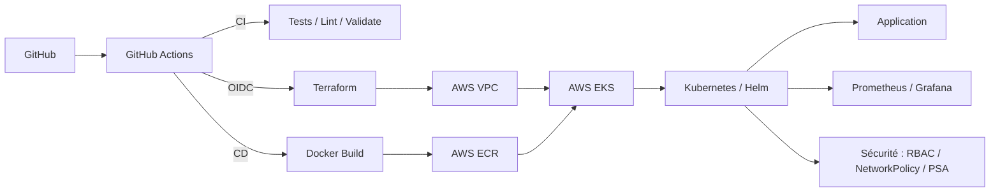

Architecture AWS retenue — **profil low-cost** (voir `terraform/README.md`
pour le détail des choix) : 1 VPC, subnets **publics uniquement** (pas de
NAT Gateway), Security Groups restrictifs en compensation, EKS avec un seul
node group, infrastructure détruite entre les sessions de travail pour
maîtriser les coûts. L'alternative "prod-like" (subnets privés + NAT) est
documentée mais volontairement écartée pour ce projet personnel.

Le disaster recovery s'appuie sur Velero plutôt que sur un snapshot/restore
etcd, techniquement inapplicable sur un control plane EKS managé — le
raisonnement complet est dans `PLAN.md`.

### Architecture AWS détaillée

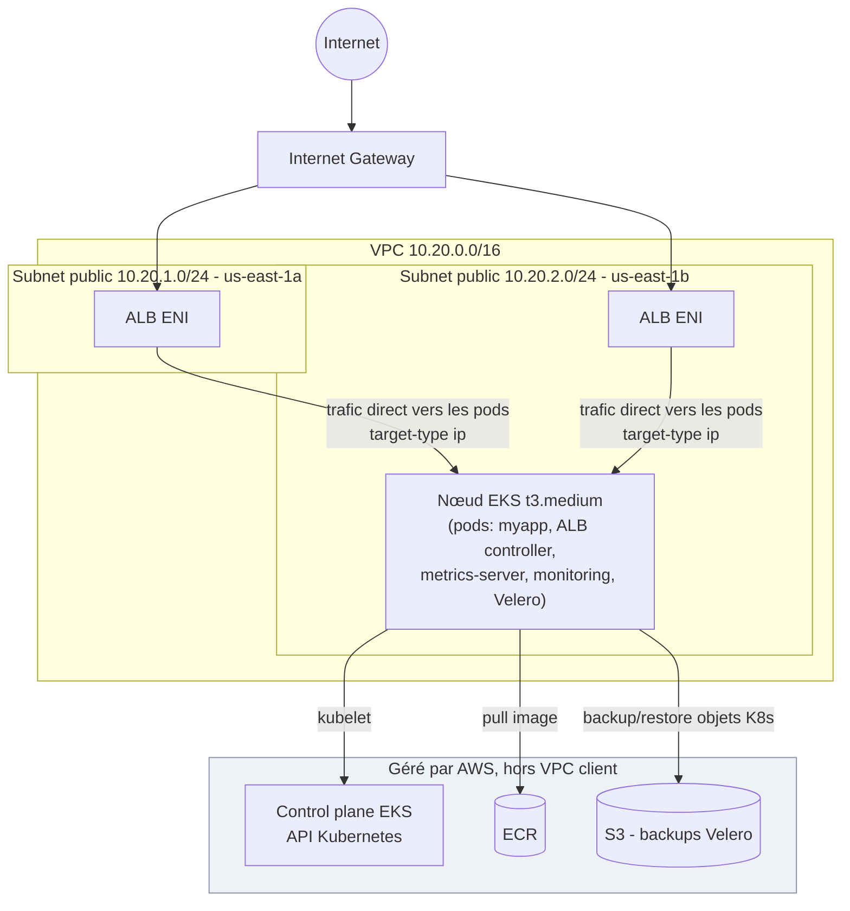

Un seul nœud dans un seul des deux subnets à la fois (taille fixe, Phase
5) ; les deux subnets existent pour la disponibilité de l'ALB sur 2 zones,
même si le node group ne couvre qu'une seule zone à la fois.

### Pipeline CI/CD

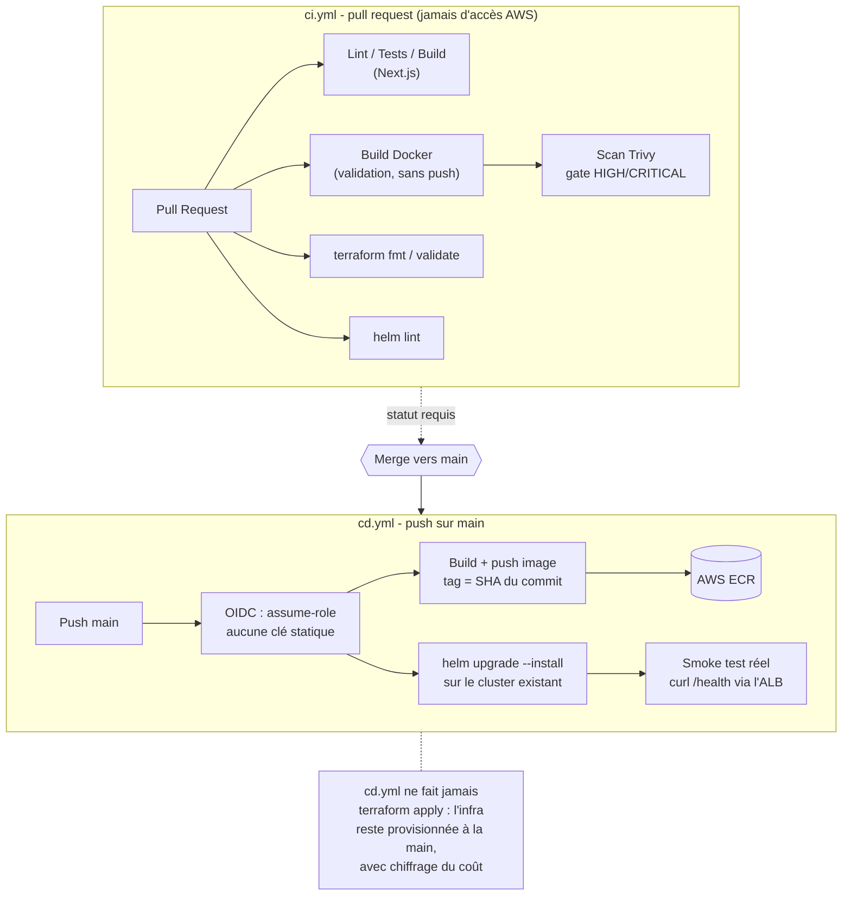

### Architecture sécurité

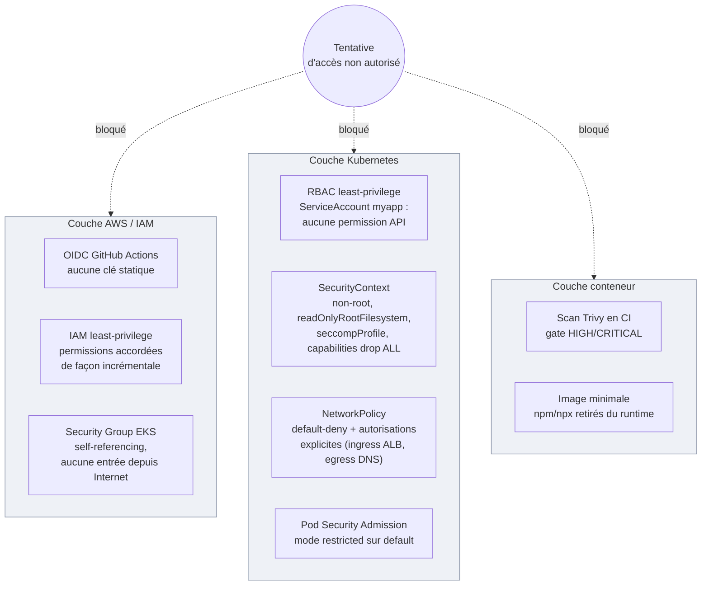

Sources versionnées de ces 4 diagrammes : `docs/diagrams/*.mmd`.

---

## Ce qui est déjà construit et vérifié

### Application (`app/`)

Next.js (TypeScript, App Router) : page d'accueil, page `/architecture`,
endpoints `/health` et `/ready`, badge d'environnement. Vérifié avec
`npm run lint`, `npm run test` (Vitest), `npm run build`, et une exécution
réelle en local (toutes les routes répondent correctement).

### Image Docker (`docker/`)

Build multi-stage sur `node:22-alpine`, utilisateur non-root, healthcheck
intégré. Image finale : 82 Mo. Vérifiée avec un `docker build` et
`docker run` réels (conteneur sain, tourne en utilisateur `nextjs`).

### CI GitHub Actions (`.github/workflows/ci.yml`)

Lint, tests et build de l'application ; build Docker de validation (sans
push) ; `terraform fmt`/`validate` ; `helm lint`. Se déclenche sur chaque
pull request et sur `push` vers `main`, ne touche jamais l'AWS réel.
Statut en direct : voir le badge en haut de ce README.

### Infrastructure AWS — VPC (`terraform/`)

VPC, 2 subnets publics (2 zones de disponibilité), Internet Gateway, table
de routage. Appliqué réellement via `terraform apply` puis vérifié de
façon indépendante avec `aws ec2 describe-vpcs`/`describe-subnets` (pas
seulement l'état Terraform). Coût : 0 $ (aucune ressource payante dans ce
lot).

**VPC dans la console AWS.** Vue détail du VPC créé par Terraform.

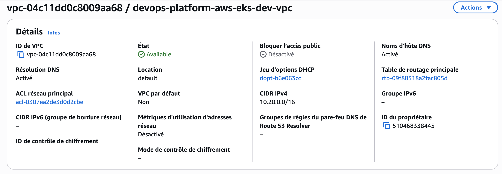

**Résultat attendu :** VPC `vpc-04c11dd0c8009aa68`, CIDR `10.20.0.0/16`,
état `Available` — identique à la sortie de `terraform apply` et à
`aws ec2 describe-vpcs`.

### ECR + OIDC GitHub Actions (`terraform/`)

Repository ECR (tags immuables, scan à la publication, lifecycle policy),
fournisseur OIDC et rôle IAM que GitHub Actions pourra assumer sans clé
statique (scopé au repo et à la branche `main` via le `sub` claim).
Permissions accordées de façon incrémentale : uniquement le push ECR pour
l'instant. Appliqué réellement, vérifié indépendamment via `aws ecr
describe-repositories`, `aws iam list-open-id-connect-providers` et `aws
iam get-role`. Premier push d'image manuel réussi et vérifié via `aws ecr
describe-images`. Coût : stockage de l'image seul, environ 0,01 $/mois.

**Image poussée sur ECR, scan de vulnérabilités inclus.**

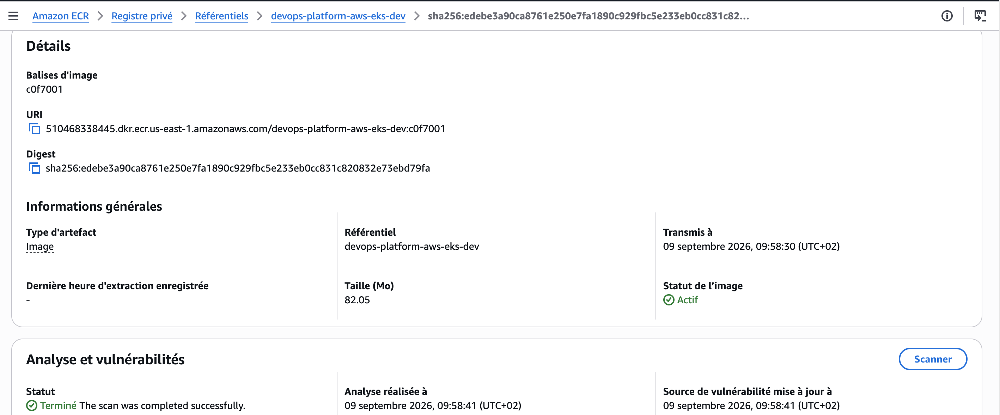

**Résultat attendu :** tag `c0f7001`, 82,05 Mo, digest identique à celui
renvoyé par `docker push`, scan de vulnérabilités "Terminé".

**Trust policy du rôle IAM GitHub Actions.** Scope volontairement strict :
seule la branche `main` de ce repository exact peut assumer ce rôle.

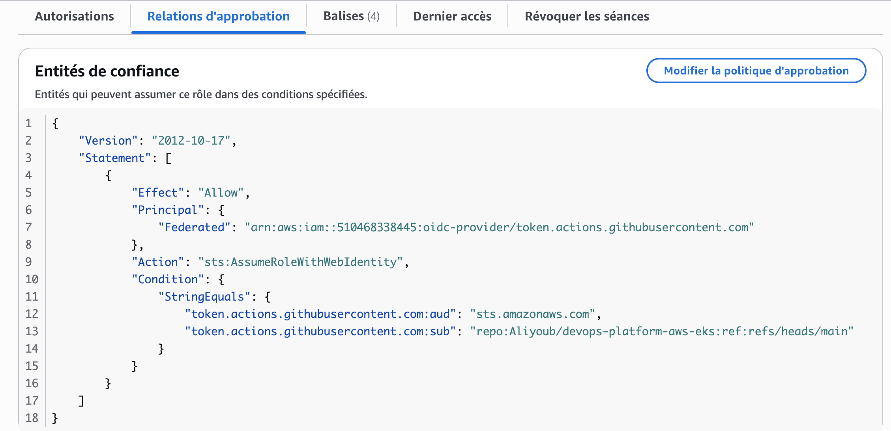

**Résultat attendu :** `Federated` principal pointant vers le fournisseur
OIDC GitHub, condition `token.actions.githubusercontent.com:sub` égale à
`repo:Aliyoub/devops-platform-aws-eks:ref:refs/heads/main` — identique au
`terraform plan` de `oidc.tf`.

### Cluster EKS + node group (`terraform/`)

Control plane EKS (Kubernetes 1.36, version non épinglée — voir
`terraform/README.md`), 1 node group managé (1 nœud `t3.medium`,
`ON_DEMAND`), accès admin via Access Entries (pas d'ancien `aws-auth`
ConfigMap). Aucun security group personnalisé pour le control plane/les
nœuds : vérifié contre la documentation AWS que le security group
auto-géré par EKS (self-referencing, aucune entrée depuis Internet même
avec des IP publiques faute de NAT) suffit et remplace un pattern devenu
obsolète pour un node group managé. Seul le security group par défaut du
VPC est durci à la main (vidé de toute règle).

Appliqué réellement, vérifié indépendamment : `kubectl get nodes` (nœud
`Ready`), `kubectl get pods -A` (CNI, CoreDNS, kube-proxy tous `Running`),
et `aws ec2 describe-security-groups` pour confirmer l'absence de règle
entrante depuis `0.0.0.0/0`. Coût : ~0,14 $/heure pendant que le cluster
tourne (control plane + nœud), détruit après chaque session de travail.

**Cluster dans la console AWS.**

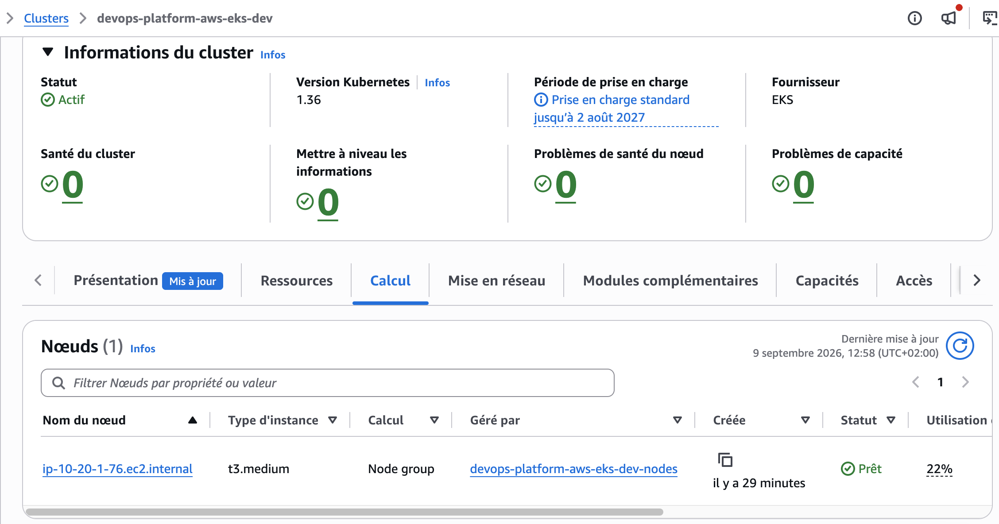

**Résultat attendu :** cluster `devops-platform-aws-eks-dev` actif,
Kubernetes 1.36, un nœud `t3.medium` géré par le node group
`devops-platform-aws-eks-dev-nodes`, statut `Prêt` — identique à `kubectl
get nodes`.

### Chart Helm de l'application + AWS Load Balancer Controller (`helm/`)

AWS Load Balancer Controller v3.5.0 installé via Helm (namespace
`kube-system`), authentifié à AWS par IRSA (rôle IAM dédié, aucune clé
statique). Add-on EKS `metrics-server` ajouté pour que le
`HorizontalPodAutoscaler` de l'application dispose de vraies métriques CPU
plutôt que d'être décoratif.

Chart `helm/myapp` : Deployment (2 replicas, rolling update sans
indisponibilité), Service, Ingress `alb` (provisionne un vrai Application
Load Balancer), ConfigMap, ServiceAccount dédié, HPA (2 à 4 replicas, cible
CPU 70%), PodDisruptionBudget. Conteneur en `readOnlyRootFilesystem`,
non-root, toutes les capabilities Linux retirées.

Déployé réellement (`helm install`) et vérifié de bout en bout, pas
seulement le statut de la commande : `kubectl get pods` (2/2 `Running`),
l'Ingress réconcilié avec un vrai nom DNS d'ALB, les 4 routes de
l'application (`/`, `/architecture`, `/health`, `/ready`) répondant `200`
en HTTP à travers cet ALB public, et le HPA affichant une métrique CPU
chiffrée (`cpu: 2%/70%`) plutôt que `<unknown>`.

**Application accessible via un vrai ALB, testée en HTTP réel (pas
`localhost`) :**

```
$ curl http://k8s-default-myapp-1ad070390a-2090973047.us-east-1.elb.amazonaws.com/health
{"status":"ok"}
$ curl http://k8s-default-myapp-1ad070390a-2090973047.us-east-1.elb.amazonaws.com/ready
{"status":"ready","environment":"dev"}
```

**Page d'accueil rendue dans un vrai navigateur, via l'ALB public** (pas
`localhost`, pas de capture inventée) :

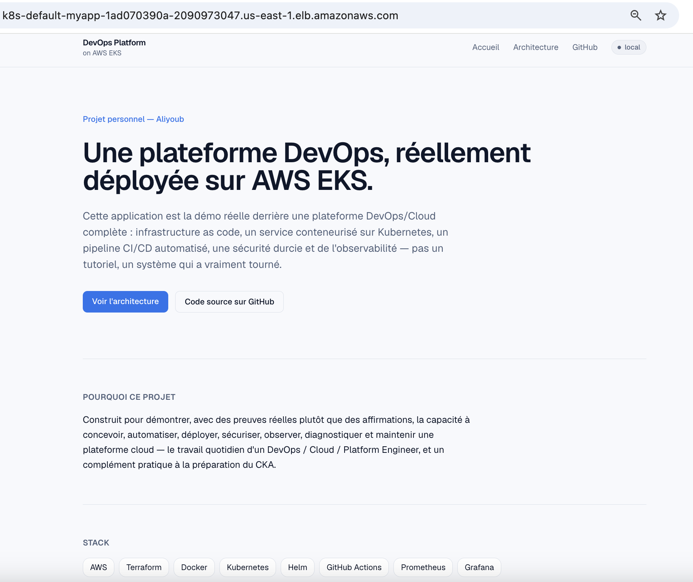

**ALB créé par l'Ingress**, tags posés automatiquement par l'AWS Load
Balancer Controller :

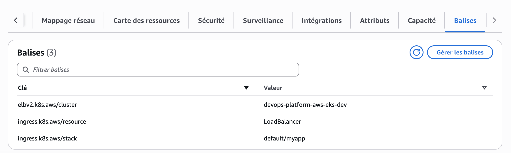

**Résultat attendu :** tag `ingress.k8s.aws/stack = default/myapp` —
confirme que cet ALB a bien été provisionné par notre Ingress, pas une
ressource manuelle.

Coût additionnel de cette phase : ALB ~0,0225 $/heure + facturation LCU
(usage), en plus du cluster déjà compté en Phase 5.

### Pipeline CD (`.github/workflows/cd.yml`)

Se déclenche sur push vers `main` touchant `app/`, `docker/` ou `helm/`
(ou manuellement via `workflow_dispatch`). Construit l'image, la pousse sur
ECR taguée avec le SHA du commit, déploie via `helm upgrade --install`, puis
un vrai smoke test interroge `/health` à travers l'ALB jusqu'à recevoir un
`200`. Authentifié à AWS uniquement par OIDC (le même rôle IAM que pour
ECR, avec des permissions étendues de façon incrémentale : `eks:DescribeCluster`
et un accès EKS scopé au seul namespace `default` — pas cluster-admin).

Volontairement, `cd.yml` ne fait **aucun** `terraform apply` : un pipeline
non surveillé qui provisionnerait de l'infrastructure payante à chaque push
contournerait la règle de ce projet consistant à toujours signaler le coût
avant de créer une ressource facturable. `cd.yml` déploie l'application sur
un cluster qui existe déjà.

**Bug réel rencontré et corrigé** : le premier run a échoué sur
`sts:AssumeRoleWithWebIdentity` malgré une trust policy suivant exactement
le format documenté par GitHub. Diagnostiqué en décodant le vrai jeton
OIDC émis (pas en supposant) : ce compte GitHub émet des jetons au format
*immutable subject claim* (`repo:<owner>@<user_id>/<repo>@<repo_id>:ref:...`),
différent du format classique attendu — et l'API GitHub censée indiquer ce
réglage (`.../actions/oidc/customization/sub`) répondait `false` de façon
trompeuse. Détail complet dans `terraform/README.md`.

**Run réel réussi**, déployant l'image du commit qui a introduit ce
correctif : https://github.com/Aliyoub/devops-platform-aws-eks/actions/runs/34393943314

**Moindre privilège appliqué à la CD, des deux côtés (IAM et Kubernetes) :**

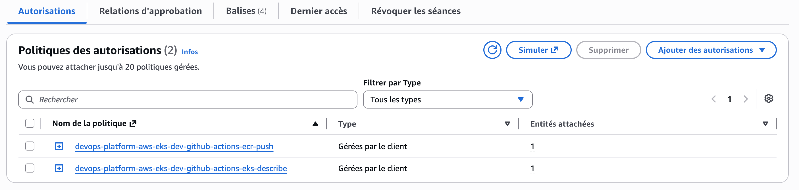

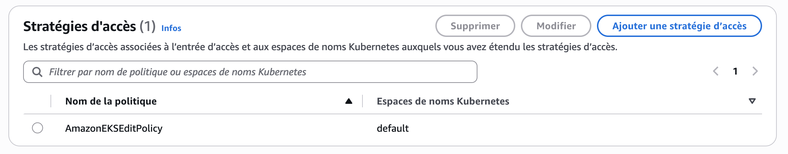

**Résultat attendu :** côté IAM, seulement 2 policies (`ecr-push`,
`eks-describe`) — rien de plus. Côté EKS, `AmazonEKSEditPolicy` appliquée
uniquement au namespace `default`, jamais un accès cluster-admin.

### Observabilité — Prometheus/Grafana (`monitoring/`)

`kube-prometheus-stack` (chart 90.0.0) installé avec des réglages adaptés à
un cluster EKS mono-nœud : Alertmanager désactivé (aucune destination
réelle configurée), moniteurs `etcd`/`kube-scheduler`/`kube-controller-manager`
désactivés (control plane managé par AWS, non exposé au client), pas de
stockage persistant (infrastructure détruite entre les sessions). Mot de
passe admin Grafana généré aléatoirement par Helm, jamais commité.

Un dashboard Grafana personnalisé (`monitoring/dashboards/myapp-overview.json`,
6 panneaux : pods disponibles/voulus, pods `Running`, CPU et mémoire par
pod de l'application, CPU et mémoire du nœud) est appliqué automatiquement
via un ConfigMap labellisé, découvert par le sidecar Grafana — aucune étape
manuelle dans l'UI.

**Bug réel rencontré** : le premier `helm install` a échoué, le conteneur
Grafana partant en `OOMKilled` en boucle (limite mémoire de 128 Mi
insuffisante pour l'image `grafana/grafana:13.2.1-distroless`). Constaté
via `kubectl describe pod`, corrigé en passant la limite à 384 Mi, revérifié
par un `helm upgrade` réel. Détail complet dans `monitoring/README.md`.

Chaque panneau vérifié individuellement avec de vraies requêtes PromQL
retournant des données réelles (pas seulement "le dashboard s'affiche") :
par exemple `kube_deployment_status_replicas_available{namespace="default",
deployment="myapp"}` renvoie bien `2`.

**Le dashboard, en vrai, avec des données réelles :**

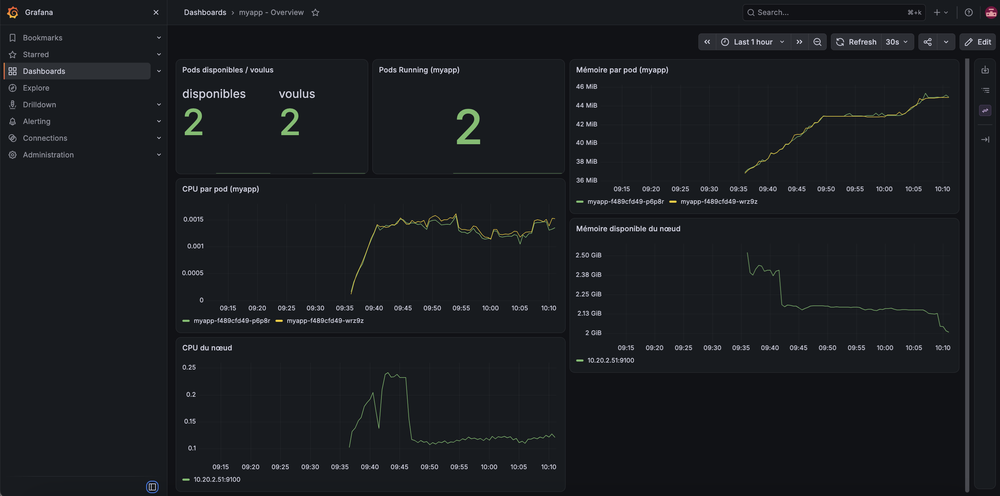

**Résultat attendu :** 2/2 pods disponibles, mémoire par pod ~36-46 MiB,
CPU du nœud variant entre ~0,1 et ~0,25 cœur — cohérent avec un cluster
mono-nœud `t3.medium` hébergeant l'app, le contrôleur ALB et le stack de
monitoring lui-même.

### Durcissement sécurité (`helm/`, `security/`, `.github/workflows/ci.yml`)

Défense en profondeur sur trois couches — détail complet dans
`security/README.md` :

- **RBAC** : le ServiceAccount `myapp` n'a aucun Role/RoleBinding — vérifié
  (`kubectl auth can-i list pods --as=system:serviceaccount:default:myapp`
  → `no`).
- **SecurityContext** : non-root, `readOnlyRootFilesystem`,
  `allowPrivilegeEscalation: false`, `capabilities.drop: [ALL]`,
  `seccompProfile: RuntimeDefault`.
- **NetworkPolicy** default-deny + autorisations explicites (ingress limité
  au port applicatif depuis le VPC, egress limité au DNS).
- **Pod Security Admission** en mode `restricted` sur le namespace
  `default`.
- **Scan Trivy** intégré à `ci.yml`, bloque le pipeline sur toute
  vulnérabilité HIGH/CRITICAL corrigeable.

**Deux bugs réels rencontrés et corrigés, pas seulement anticipés :**

1. Les `NetworkPolicy` n'avaient d'abord aucun effet réel : un test
   d'egress volontairement interdit (requête sortante vers un site externe
   depuis un pod) réussissait quand même, malgré un agent d'application
   (`aws-eks-nodeagent`) bien `Running`. Cause trouvée en interrogeant le
   schéma de configuration réel de l'addon `vpc-cni`
   (`aws eks describe-addon-configuration`) plutôt qu'en devinant : la clé
   `enableNetworkPolicy` n'était pas activée. Corrigé, revérifié par le
   même test — désormais bloqué (timeout). Détail dans
   `terraform/README.md`.
2. Un vrai scan Trivy a trouvé des vulnérabilités HIGH/CRITICAL réelles :
   des paquets Alpine non patchés, et surtout `npm`/`npx` embarqués dans
   l'image finale avec leurs propres dépendances vulnérables, alors que le
   runtime n'exécute jamais `npm`. Corrigé dans `docker/Dockerfile`,
   revérifié par un nouveau scan : 0 vulnérabilité HIGH/CRITICAL. Détail
   dans `docker/README.md`.

**La correction du bug NetworkPolicy, dans la console AWS :**

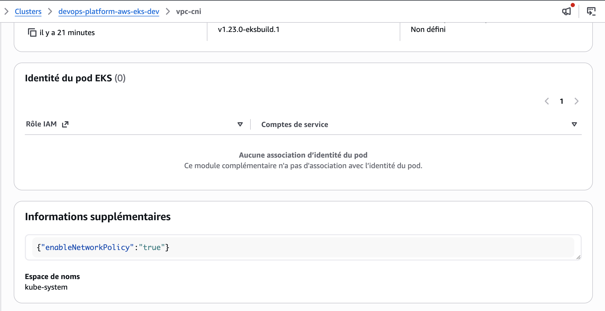

**Résultat attendu :** `{"enableNetworkPolicy":"true"}` sur l'addon
`vpc-cni` — identique à la configuration Terraform appliquée.

### Troubleshooting (`troubleshooting/`)

5 incidents réalistes **réellement reproduits** sur le cluster de ce
projet (pas décrits de mémoire) : déclenchés volontairement, diagnostiqués
avec les vraies commandes `kubectl`, corrigés, puis vérifiés — sorties de
commandes réelles à chaque étape. Détail complet dans
`troubleshooting/README.md`.

| # | Incident | Cause |
|---|---|---|
| 1 | Pod ne démarre pas | Probe de liveness pointant vers un chemin inexistant |
| 2 | Service inaccessible | Sélecteur du Service ne correspondant à aucun pod |
| 3 | RBAC insuffisant | ServiceAccount sans Role/RoleBinding |
| 4 | Pod bloqué en Pending | `resources.requests` dépassant la capacité du nœud |
| 5 | ImagePullBackOff | Tag d'image inexistant sur ECR |

Les incidents 1, 2, 4 et 5 ont été provoqués directement sur le
déploiement réel `myapp` (modification temporaire du chart, observation du
symptôme réel, correction, retour vérifié à l'état initial). L'incident 3
utilise un ServiceAccount et un pod de debug dédiés pour ne jamais
perturber l'application en fonctionnement.

<details>
<summary><strong>Incident 1 — Pod ne démarre pas (cliquer pour le détail réel)</strong></summary>

**Symptôme** — le pod redémarre en boucle au lieu de se stabiliser :

```
NAME                    READY   STATUS    RESTARTS      AGE
myapp-64f967df9-8cfk4   0/1     Running   3 (19s ago)   109s
```

**Diagnostic** — `kubectl describe pod` donne la cause exacte, et
`kubectl logs` confirme que l'application elle-même est saine :

```
Warning  Unhealthy  4s (x11 over 104s)  kubelet  Liveness probe failed: HTTP probe failed with statuscode: 404
```
```
▲ Next.js 16.3.4
✓ Ready in 0ms
```

**Cause** — le `livenessProbe` pointait vers `/wrong-health`, un chemin qui
n'existe pas (les vraies routes sont `/health`/`/ready`).

**Correction** — remettre le bon chemin dans
`helm/myapp/templates/deployment.yaml`, puis `helm upgrade --wait`.

**Vérification** :

```
NAME                    READY   STATUS    RESTARTS   AGE
myapp-648776bd7-8s2dt   1/1     Running   0          15s
myapp-648776bd7-p5wh8   1/1     Running   0          26s
```

Détail complet : [`troubleshooting/incident-1-pod-crashloop/`](troubleshooting/incident-1-pod-crashloop/)

</details>

<details>
<summary><strong>Incident 2 — Service inaccessible (cliquer pour le détail réel)</strong></summary>

**Symptôme** — pods sains, mais l'app ne répond plus du tout via l'ALB :

```
$ curl -o /dev/null -w "HTTP: %{http_code}\n" http://<alb>/health
HTTP: 503
```

**Diagnostic** — le Service n'a aucune cible :

```
$ kubectl get endpoints myapp
NAME    ENDPOINTS   AGE
myapp   <none>      78m
```

`kubectl describe svc myapp` révèle pourquoi : le sélecteur ne correspond
à aucun label réel des pods :

```
Selector:  app.kubernetes.io/instance=myapp,app.kubernetes.io/name=wrong-app-name
```

**Cause** — sélecteur du Service codé en dur et incohérent avec les labels
réellement posés sur les pods (`myapp`).

**Correction** — revenir au helper partagé (`myapp.selectorLabels`) plutôt
qu'un sélecteur écrit à la main, puis `helm upgrade --wait`.

**Vérification** :

```
$ kubectl get endpoints myapp
myapp   10.20.2.119:3000,10.20.2.56:3000   78m
$ curl -o /dev/null -w "HTTP: %{http_code}\n" http://<alb>/health
HTTP: 200
```

Détail complet : [`troubleshooting/incident-2-service-inaccessible/`](troubleshooting/incident-2-service-inaccessible/)

</details>

<details>
<summary><strong>Incident 3 — RBAC insuffisant (cliquer pour le détail réel)</strong></summary>

**Symptôme** — un pod de debug ne peut pas lister les pods du namespace :

```
$ kubectl exec debug-tools -- kubectl get pods -n default
Error from server (Forbidden): pods is forbidden: User
"system:serviceaccount:default:debug-tools" cannot list resource "pods"
in API group "" in the namespace "default"
```

**Diagnostic** :

```
$ kubectl auth can-i list pods --as=system:serviceaccount:default:debug-tools -n default
no
```

**Cause** — le ServiceAccount `debug-tools` n'avait aucun Role/RoleBinding
associé (comportement par défaut de Kubernetes : zéro permission).

**Correction** — un `Role` scopé au strict nécessaire (lire les pods du
namespace `default`, rien de plus), lié via un `RoleBinding`.

**Vérification** — accès accordé, et surtout toujours refusé sur une
ressource non demandée (preuve que la correction reste minimale) :

```
$ kubectl auth can-i list pods --as=system:serviceaccount:default:debug-tools -n default
yes
$ kubectl auth can-i list secrets --as=system:serviceaccount:default:debug-tools -n default
no
```

Détail complet : [`troubleshooting/incident-3-rbac/`](troubleshooting/incident-3-rbac/)

</details>

<details>
<summary><strong>Incident 4 — Pod bloqué en Pending (cliquer pour le détail réel)</strong></summary>

**Symptôme** :

```
NAME                    READY   STATUS    RESTARTS   AGE
myapp-5975868d7-nlmd9   0/1     Pending   0          41s
```

**Diagnostic** — `kubectl describe pod` nomme directement la ressource en
cause :

```
Warning  FailedScheduling  48s  default-scheduler  0/1 nodes are
available: 1 Insufficient cpu.
```

**Cause** — `resources.requests.cpu` fixé à `10` (10 cœurs), très au-delà
de la capacité du nœud unique (`t3.medium`, 2 vCPU). Un premier essai avec
seulement `requests.cpu=10` avait d'ailleurs été rejeté encore plus tôt, à
l'admission du Deployment (Kubernetes refuse `request > limit`) — il a
fallu élever aussi la limite pour obtenir le vrai scénario de scheduling
visé.

**Correction** — retour aux valeurs réalistes de `values-dev.yaml`
(`requests.cpu: 100m`), `helm upgrade --wait`.

**Vérification** :

```
NAME                    READY   STATUS    RESTARTS   AGE
myapp-648776bd7-8s2dt   1/1     Running   0          8m18s
myapp-648776bd7-p5wh8   1/1     Running   0          8m29s
```

Détail complet : [`troubleshooting/incident-4-resources/`](troubleshooting/incident-4-resources/)

</details>

<details>
<summary><strong>Incident 5 — ImagePullBackOff (cliquer pour le détail réel)</strong></summary>

**Symptôme** :

```
NAME                     READY   STATUS         RESTARTS   AGE
myapp-5d467f95d4-r6r8l   0/1     ErrImagePull   0          63s
```

**Diagnostic** — `kubectl describe pod` renvoie le message exact du
registre :

```
Warning  Failed   kubelet   Failed to pull image "...devops-platform-aws-eks-dev:does-not-exist":
rpc error: code = NotFound desc = ... not found
Normal   BackOff  kubelet   Back-off pulling image "...does-not-exist"
Warning  Failed   kubelet   Error: ImagePullBackOff
```

**Cause** — tag d'image (`does-not-exist`) jamais poussé sur ECR.

**Correction** — redéployer avec un tag réellement présent sur ECR (le SHA
du commit construit par la CI/CD), `helm upgrade --wait`.

**Vérification** :

```
NAME                    READY   STATUS    RESTARTS   AGE
myapp-648776bd7-8s2dt   1/1     Running   0          10m
myapp-648776bd7-p5wh8   1/1     Running   0          10m
$ curl -o /dev/null -w "HTTP: %{http_code}\n" http://<alb>/health
HTTP: 200
```

Détail complet : [`troubleshooting/incident-5-imagepullbackoff/`](troubleshooting/incident-5-imagepullbackoff/)

</details>

### Disaster Recovery (`disaster-recovery/`)

Le brief initial demandait un snapshot/restore etcd classique —
techniquement impossible sur un control plane EKS managé (AWS le gère,
aucun accès client). Adapté en deux volets, tous deux réellement testés,
raisonnement complet dans `disaster-recovery/README.md` :

**1. Backup/restore applicatif avec Velero** (bucket S3 dédié, IRSA, pas de
permissions EBS accordées puisque ce projet n'a aucun `PersistentVolume`) :

```
$ kubectl apply -f disaster-recovery/backup.yaml
$ kubectl get backup myapp-backup -n velero
Phase: Completed   Items Backed Up: 128/128

$ helm uninstall myapp   # désastre simulé, réel
$ kubectl get deploy,svc,ingress -l app.kubernetes.io/instance=myapp
No resources found in default namespace.

$ kubectl apply -f disaster-recovery/restore.yaml
$ kubectl get restore myapp-restore -n velero
Phase: PartiallyFailed   Items Restored: 41/41   Errors: 1
```

L'unique erreur touchait un `TargetGroupBinding` généré automatiquement
par le contrôleur ALB (référençant un target group déjà supprimé) — sans
conséquence : le contrôleur l'a régénéré tout seul en reconciliant
l'Ingress restauré. Tout le reste (Deployment, Service, ConfigMap, HPA,
PDB, NetworkPolicy, ServiceAccount) restauré et fonctionnel :

```
$ curl http://<nouvel-alb>/ready
{"status":"ready","environment":"dev"}
```

Découverte réelle et positive : le backup couvrant tout le namespace
`default` a incidemment restauré le Secret de suivi interne de Helm — un
`helm upgrade` normal a fonctionné juste après, sans réconciliation
manuelle.

**Le bucket S3 des sauvegardes, dans la console AWS :**

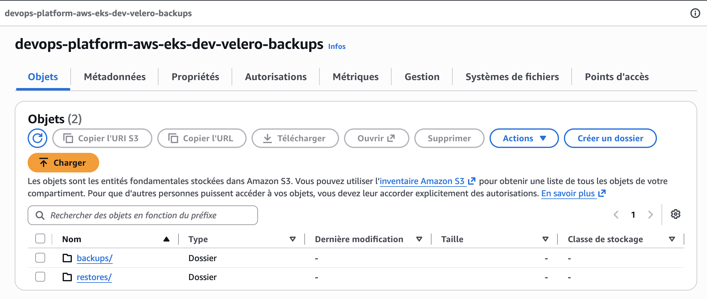

**Résultat attendu :** deux dossiers, `backups/` et `restores/` — cohérent
avec le cycle backup → restore réellement exécuté ci-dessus.

**2. Test de résilience nœud** (2ᵉ nœud temporaire, coût confirmé avant
exécution, ~0,04 $ pour quelques minutes) : `kubectl drain` du nœud
hébergeant les 2 replicas de l'application.

```
evicting pod default/myapp-648776bd7-8s2dt
error when evicting pods/"myapp-648776bd7-8s2dt" -n "default" (will retry
after 5s): Cannot evict pod as it would violate the pod's disruption budget.
[... jusqu'à ce que le remplaçant soit Ready sur l'autre nœud ...]
pod/myapp-648776bd7-8s2dt evicted
```

Le `PodDisruptionBudget` a réellement bloqué l'éviction du dernier pod
tant que son remplaçant n'était pas prêt ailleurs. Disponibilité mesurée
pendant l'opération (pas supposée) : ~18 secondes de creux (`502`/timeout)
pendant la bascule de l'ALB, puis rétabli. Honnêteté sur la limite : avec
un seul nœud de départ, les deux replicas partageaient le même point de
défaillance — une vraie haute disponibilité demanderait plusieurs nœuds en
permanence, un choix délibérément écarté pour rester low-cost.

---

## Développement local

```
cd app
npm install
npm run dev          # http://localhost:3000
npm run lint
npm run test
npm run build
```

```
docker build -f docker/Dockerfile -t devops-platform-aws-eks:local .
docker run --rm -p 3000:3000 -e APP_ENV=local devops-platform-aws-eks:local
```

```
cd terraform
terraform init
terraform plan
terraform apply

./scripts/get-kubeconfig.sh
KUBECONFIG=~/.kube/devops-platform-aws-eks.yaml kubectl get nodes
```

---

## Coûts AWS

Profil low-cost : pas de NAT Gateway, un seul nœud EKS (deux
temporairement lors du test de résilience, Phase 11), infrastructure
détruite entre les sessions de travail plutôt que laissée tourner en
continu.

**Coût réel final, vérifié via AWS Cost Explorer** (pas une estimation) sur
toute la durée du projet (2026-09-08 → 2026-09-11, toutes les sessions de
travail confondues) :

| Service | Coût |
|---|---|
| Amazon EKS (control plane) | 0,6991 $ |
| EC2 (nœud(s), y compris le 2ᵉ nœud temporaire du test de résilience) | 0,2832 $ |
| Elastic Load Balancing (ALB) | 0,1350 $ |
| VPC | 0,0845 $ |
| EC2 - Other (EBS/volumes) | 0,0153 $ |
| S3 (backups Velero) | 0,0029 $ |
| AWS Cost Explorer (vérifier ce coût a lui-même un coût — clin d'œil méta) | 0,0200 $ |
| Route 53 | 0,0021 $ *(hors périmètre de ce projet — activité préexistante du compte, non liée à cette infrastructure)* |
| **Total réel du projet** | **1,2423 $** |

Pour comparaison, un profil "prod-like" (subnets privés + NAT Gateway)
tournant en continu aurait coûté environ 150-160 $/mois (détail dans
`PLAN.md`). Détruire l'infrastructure entre chaque session de travail,
plutôt que la laisser tourner, a réduit le coût réel de ce projet complet
à **un peu plus d'un dollar**.

---

## Auteur

**Aliyoub** — [github.com/Aliyoub](https://github.com/Aliyoub)
