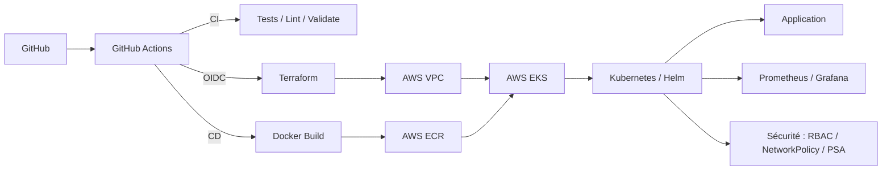

# DevOps Platform on AWS EKS


Une plateforme DevOps/Cloud déployée sur AWS EKS : Terraform, Docker,
Kubernetes, Helm, GitHub Actions (OIDC), sécurité, observabilité,
troubleshooting et disaster recovery.

> **Statut : projet en cours de construction, documenté au fil de l'eau.**
> Ce README reflète honnêtement ce qui est réellement fait et vérifié, pas
> l'objectif final présenté comme acquis. La section
> [Avancement](#avancement) fait la distinction phase par phase.

---

## Sommaire

- [Présentation](#présentation)
- [Avancement](#avancement)
- [Architecture](#architecture)
- [Ce qui est déjà construit et vérifié](#ce-qui-est-déjà-construit-et-vérifié)
- [Développement local](#développement-local)
- [Sécurité, observabilité, troubleshooting, disaster recovery](#sécurité-observabilité-troubleshooting-disaster-recovery)
- [Coûts AWS](#coûts-aws)
- [Auteur](#auteur)

---

## Présentation

**What.** Une application web conteneurisée, déployée sur AWS EKS via
Terraform et Helm, avec un pipeline CI/CD GitHub Actions authentifié par
OIDC, une sécurité Kubernetes durcie, de l'observabilité Prometheus/Grafana,
et des procédures de troubleshooting et de disaster recovery réellement
testées.

**Why.** Démontrer, avec des preuves réelles plutôt que des affirmations, la
capacité à concevoir, automatiser, déployer, sécuriser, observer,
diagnostiquer et maintenir une plateforme cloud — le travail quotidien d'un
DevOps/Cloud/Platform Engineer, en lien avec la préparation du CKA.

**Stack.** AWS (VPC, EKS, ECR, IAM), Terraform, Docker, Kubernetes, Helm,
GitHub Actions, Next.js, Prometheus, Grafana, Velero.

**Architecture.** Voir la [section dédiée](#architecture) ci-dessous.

**Skills demonstrated.** Infrastructure as Code, sécurité Kubernetes/AWS en
défense en profondeur, CI/CD sans credential statique, observabilité,
troubleshooting réel, disaster recovery adapté à un Kubernetes managé.

---

## Avancement

| Phase | Contenu | Statut |
|---|---|---|
| 0 | Environnement (gh, AWS, kubectl/helm/eksctl, Terraform) | Fait |
| 1 | Application Next.js + image Docker | Fait |
| 2 | Pipeline CI GitHub Actions | Fait |
| 3 | VPC AWS (Terraform) | Fait |
| 4 | ECR + IAM + OIDC GitHub Actions | Fait |
| 5 | Cluster EKS + node group | Fait |
| 6 | Helm chart + AWS Load Balancer Controller | Fait |
| 7 | Pipeline CD (déploiement automatisé) | Fait |
| 8 | Observabilité (Prometheus/Grafana) | Fait |
| 9 | Durcissement sécurité (RBAC, NetworkPolicy, PSA, Trivy) | Prévu |
| 10 | Scénarios de troubleshooting réellement reproduits | Prévu |
| 11 | Disaster recovery (Velero + résilience nœud) | Prévu |
| 12 | Diagrammes, captures d'écran, finalisation documentation | Prévu |
| 13 | Revue des coûts, `terraform destroy`, rapport final | Prévu |

Chaque étape marquée "Fait" a été réellement exécutée et vérifiée (build,
tests, `terraform apply`, contrôle indépendant via AWS CLI le cas échéant) —
jamais seulement écrite puis supposée fonctionnelle.

---

## Architecture

Chaîne de livraison visée :



Architecture AWS retenue — **profil low-cost** (voir `terraform/README.md`
pour le détail des choix) : 1 VPC, subnets **publics uniquement** (pas de
NAT Gateway), Security Groups restrictifs en compensation, EKS avec un seul
node group, infrastructure détruite entre les sessions de travail pour
maîtriser les coûts. L'alternative "prod-like" (subnets privés + NAT) est
documentée mais volontairement écartée pour ce projet personnel.

Le disaster recovery s'appuie sur Velero plutôt que sur un snapshot/restore
etcd, techniquement inapplicable sur un control plane EKS managé — le
raisonnement complet est dans `PLAN.md`.

D'autres diagrammes (architecture AWS détaillée, pipeline CI/CD, sécurité)
seront ajoutés en Phase 12.

---

## Ce qui est déjà construit et vérifié

### Application (`app/`)

Next.js (TypeScript, App Router) : page d'accueil, page `/architecture`,
endpoints `/health` et `/ready`, badge d'environnement. Vérifié avec
`npm run lint`, `npm run test` (Vitest), `npm run build`, et une exécution
réelle en local (toutes les routes répondent correctement).

### Image Docker (`docker/`)

Build multi-stage sur `node:22-alpine`, utilisateur non-root, healthcheck
intégré. Image finale : 82 Mo. Vérifiée avec un `docker build` et
`docker run` réels (conteneur sain, tourne en utilisateur `nextjs`).

### CI GitHub Actions (`.github/workflows/ci.yml`)

Lint, tests et build de l'application ; build Docker de validation (sans
push) ; `terraform fmt`/`validate` ; `helm lint`. Se déclenche sur chaque
pull request et sur `push` vers `main`, ne touche jamais l'AWS réel.
Statut en direct : voir le badge en haut de ce README.

### Infrastructure AWS — VPC (`terraform/`)

VPC, 2 subnets publics (2 zones de disponibilité), Internet Gateway, table
de routage. Appliqué réellement via `terraform apply` puis vérifié de
façon indépendante avec `aws ec2 describe-vpcs`/`describe-subnets` (pas
seulement l'état Terraform). Coût : 0 $ (aucune ressource payante dans ce
lot).

**VPC dans la console AWS.** Vue détail du VPC créé par Terraform.


**Résultat attendu :** VPC `vpc-04c11dd0c8009aa68`, CIDR `10.20.0.0/16`,
état `Available` — identique à la sortie de `terraform apply` et à
`aws ec2 describe-vpcs`.

### ECR + OIDC GitHub Actions (`terraform/`)

Repository ECR (tags immuables, scan à la publication, lifecycle policy),
fournisseur OIDC et rôle IAM que GitHub Actions pourra assumer sans clé
statique (scopé au repo et à la branche `main` via le `sub` claim).
Permissions accordées de façon incrémentale : uniquement le push ECR pour
l'instant. Appliqué réellement, vérifié indépendamment via `aws ecr
describe-repositories`, `aws iam list-open-id-connect-providers` et `aws
iam get-role`. Premier push d'image manuel réussi et vérifié via `aws ecr
describe-images`. Coût : stockage de l'image seul, environ 0,01 $/mois.

**Image poussée sur ECR, scan de vulnérabilités inclus.**


**Résultat attendu :** tag `c0f7001`, 82,05 Mo, digest identique à celui
renvoyé par `docker push`, scan de vulnérabilités "Terminé".

**Trust policy du rôle IAM GitHub Actions.** Scope volontairement strict :
seule la branche `main` de ce repository exact peut assumer ce rôle.


**Résultat attendu :** `Federated` principal pointant vers le fournisseur
OIDC GitHub, condition `token.actions.githubusercontent.com:sub` égale à
`repo:Aliyoub/devops-platform-aws-eks:ref:refs/heads/main` — identique au
`terraform plan` de `oidc.tf`.

### Cluster EKS + node group (`terraform/`)

Control plane EKS (Kubernetes 1.36, version non épinglée — voir
`terraform/README.md`), 1 node group managé (1 nœud `t3.medium`,
`ON_DEMAND`), accès admin via Access Entries (pas d'ancien `aws-auth`
ConfigMap). Aucun security group personnalisé pour le control plane/les
nœuds : vérifié contre la documentation AWS que le security group
auto-géré par EKS (self-referencing, aucune entrée depuis Internet même
avec des IP publiques faute de NAT) suffit et remplace un pattern devenu
obsolète pour un node group managé. Seul le security group par défaut du
VPC est durci à la main (vidé de toute règle).

Appliqué réellement, vérifié indépendamment : `kubectl get nodes` (nœud
`Ready`), `kubectl get pods -A` (CNI, CoreDNS, kube-proxy tous `Running`),
et `aws ec2 describe-security-groups` pour confirmer l'absence de règle
entrante depuis `0.0.0.0/0`. Coût : ~0,14 $/heure pendant que le cluster
tourne (control plane + nœud), détruit après chaque session de travail.

**Cluster dans la console AWS.**


**Résultat attendu :** cluster `devops-platform-aws-eks-dev` actif,
Kubernetes 1.36, un nœud `t3.medium` géré par le node group
`devops-platform-aws-eks-dev-nodes`, statut `Prêt` — identique à `kubectl
get nodes`.

### Chart Helm de l'application + AWS Load Balancer Controller (`helm/`)

AWS Load Balancer Controller v3.5.0 installé via Helm (namespace
`kube-system`), authentifié à AWS par IRSA (rôle IAM dédié, aucune clé
statique). Add-on EKS `metrics-server` ajouté pour que le
`HorizontalPodAutoscaler` de l'application dispose de vraies métriques CPU
plutôt que d'être décoratif.

Chart `helm/myapp` : Deployment (2 replicas, rolling update sans
indisponibilité), Service, Ingress `alb` (provisionne un vrai Application
Load Balancer), ConfigMap, ServiceAccount dédié, HPA (2 à 4 replicas, cible
CPU 70%), PodDisruptionBudget. Conteneur en `readOnlyRootFilesystem`,
non-root, toutes les capabilities Linux retirées.

Déployé réellement (`helm install`) et vérifié de bout en bout, pas
seulement le statut de la commande : `kubectl get pods` (2/2 `Running`),
l'Ingress réconcilié avec un vrai nom DNS d'ALB, les 4 routes de
l'application (`/`, `/architecture`, `/health`, `/ready`) répondant `200`
en HTTP à travers cet ALB public, et le HPA affichant une métrique CPU
chiffrée (`cpu: 2%/70%`) plutôt que `<unknown>`.

**Application accessible via un vrai ALB, testée en HTTP réel (pas
`localhost`) :**

```
$ curl http://k8s-default-myapp-1ad070390a-2090973047.us-east-1.elb.amazonaws.com/health
{"status":"ok"}
$ curl http://k8s-default-myapp-1ad070390a-2090973047.us-east-1.elb.amazonaws.com/ready
{"status":"ready","environment":"dev"}
```

**Page d'accueil rendue dans un vrai navigateur, via l'ALB public** (pas
`localhost`, pas de capture inventée) :


**ALB créé par l'Ingress**, tags posés automatiquement par l'AWS Load
Balancer Controller :


**Résultat attendu :** tag `ingress.k8s.aws/stack = default/myapp` —
confirme que cet ALB a bien été provisionné par notre Ingress, pas une
ressource manuelle.

Coût additionnel de cette phase : ALB ~0,0225 $/heure + facturation LCU
(usage), en plus du cluster déjà compté en Phase 5.

### Pipeline CD (`.github/workflows/cd.yml`)

Se déclenche sur push vers `main` touchant `app/`, `docker/` ou `helm/`
(ou manuellement via `workflow_dispatch`). Construit l'image, la pousse sur
ECR taguée avec le SHA du commit, déploie via `helm upgrade --install`, puis
un vrai smoke test interroge `/health` à travers l'ALB jusqu'à recevoir un
`200`. Authentifié à AWS uniquement par OIDC (le même rôle IAM que pour
ECR, avec des permissions étendues de façon incrémentale : `eks:DescribeCluster`
et un accès EKS scopé au seul namespace `default` — pas cluster-admin).

Volontairement, `cd.yml` ne fait **aucun** `terraform apply` : un pipeline
non surveillé qui provisionnerait de l'infrastructure payante à chaque push
contournerait la règle de ce projet consistant à toujours signaler le coût
avant de créer une ressource facturable. `cd.yml` déploie l'application sur
un cluster qui existe déjà.

**Bug réel rencontré et corrigé** : le premier run a échoué sur
`sts:AssumeRoleWithWebIdentity` malgré une trust policy suivant exactement
le format documenté par GitHub. Diagnostiqué en décodant le vrai jeton
OIDC émis (pas en supposant) : ce compte GitHub émet des jetons au format
*immutable subject claim* (`repo:<owner>@<user_id>/<repo>@<repo_id>:ref:...`),
différent du format classique attendu — et l'API GitHub censée indiquer ce
réglage (`.../actions/oidc/customization/sub`) répondait `false` de façon
trompeuse. Détail complet dans `terraform/README.md`.

**Run réel réussi**, déployant l'image du commit qui a introduit ce
correctif : https://github.com/Aliyoub/devops-platform-aws-eks/actions/runs/34393943314

**Moindre privilège appliqué à la CD, des deux côtés (IAM et Kubernetes) :**


**Résultat attendu :** côté IAM, seulement 2 policies (`ecr-push`,
`eks-describe`) — rien de plus. Côté EKS, `AmazonEKSEditPolicy` appliquée
uniquement au namespace `default`, jamais un accès cluster-admin.

### Observabilité — Prometheus/Grafana (`monitoring/`)

`kube-prometheus-stack` (chart 90.0.0) installé avec des réglages adaptés à
un cluster EKS mono-nœud : Alertmanager désactivé (aucune destination
réelle configurée), moniteurs `etcd`/`kube-scheduler`/`kube-controller-manager`
désactivés (control plane managé par AWS, non exposé au client), pas de
stockage persistant (infrastructure détruite entre les sessions). Mot de
passe admin Grafana généré aléatoirement par Helm, jamais commité.

Un dashboard Grafana personnalisé (`monitoring/dashboards/myapp-overview.json`,
6 panneaux : pods disponibles/voulus, pods `Running`, CPU et mémoire par
pod de l'application, CPU et mémoire du nœud) est appliqué automatiquement
via un ConfigMap labellisé, découvert par le sidecar Grafana — aucune étape
manuelle dans l'UI.

**Bug réel rencontré** : le premier `helm install` a échoué, le conteneur
Grafana partant en `OOMKilled` en boucle (limite mémoire de 128 Mi
insuffisante pour l'image `grafana/grafana:13.2.1-distroless`). Constaté
via `kubectl describe pod`, corrigé en passant la limite à 384 Mi, revérifié
par un `helm upgrade` réel. Détail complet dans `monitoring/README.md`.

Chaque panneau vérifié individuellement avec de vraies requêtes PromQL
retournant des données réelles (pas seulement "le dashboard s'affiche") :
par exemple `kube_deployment_status_replicas_available{namespace="default",
deployment="myapp"}` renvoie bien `2`.

**Le dashboard, en vrai, avec des données réelles :**


**Résultat attendu :** 2/2 pods disponibles, mémoire par pod ~36-46 MiB,
CPU du nœud variant entre ~0,1 et ~0,25 cœur — cohérent avec un cluster
mono-nœud `t3.medium` hébergeant l'app, le contrôleur ALB et le stack de
monitoring lui-même.

---

## Développement local

```
cd app
npm install
npm run dev          # http://localhost:3000
npm run lint
npm run test
npm run build
```

```
docker build -f docker/Dockerfile -t devops-platform-aws-eks:local .
docker run --rm -p 3000:3000 -e APP_ENV=local devops-platform-aws-eks:local
```

```
cd terraform
terraform init
terraform plan
terraform apply

./scripts/get-kubeconfig.sh
KUBECONFIG=~/.kube/devops-platform-aws-eks.yaml kubectl get nodes
```

---

## Sécurité, observabilité, troubleshooting, disaster recovery

Pas encore implémentés (Phases 9 à 11) — cette section sera complétée avec
le même niveau de détail que le reste, uniquement une fois chaque élément
réellement construit et testé. Le raisonnement déjà arrêté pour chacun
(RBAC/SecurityContext/NetworkPolicy/PSA/Trivy, kube-prometheus-stack,
Velero) est documenté dans `PLAN.md`.

---

## Coûts AWS

Profil low-cost : pas de NAT Gateway, un seul node EKS, infrastructure
détruite entre les sessions de travail. Coût engagé à ce jour : **0 $**
(seules des ressources gratuites existent : VPC, subnets, Internet
Gateway). Le détail des coûts estimés par ressource (EKS control plane,
node EC2, ALB...) est dans `PLAN.md`, section coûts.

---

## Auteur

**Aliyoub** — [github.com/Aliyoub](https://github.com/Aliyoub)
